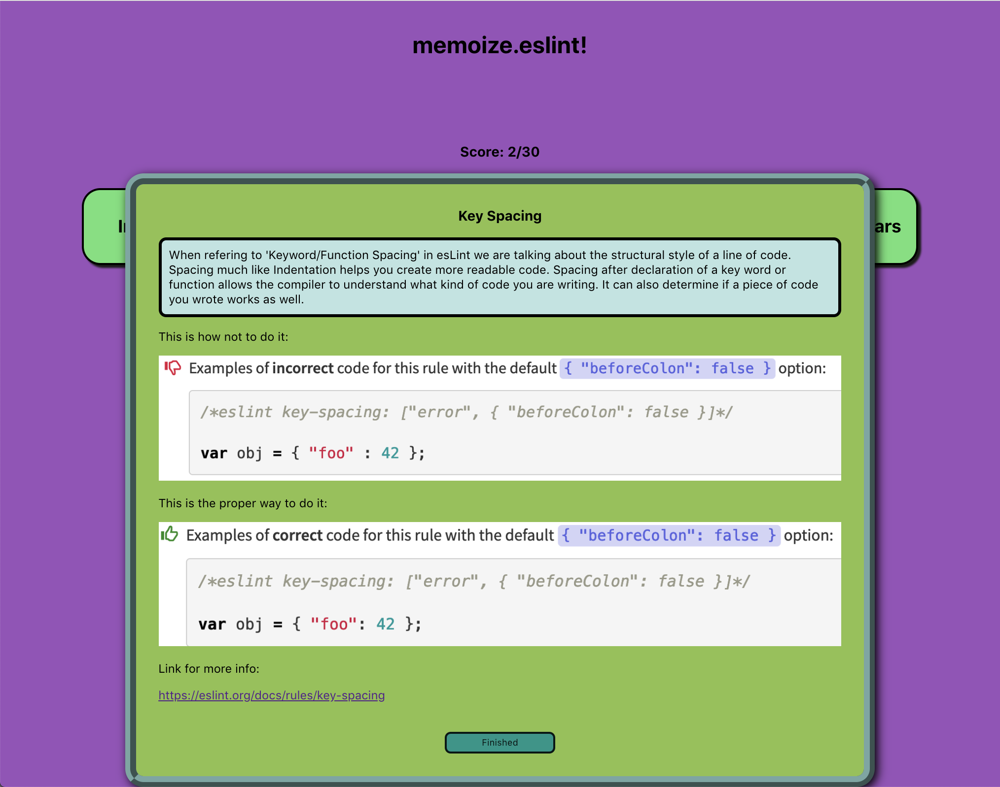
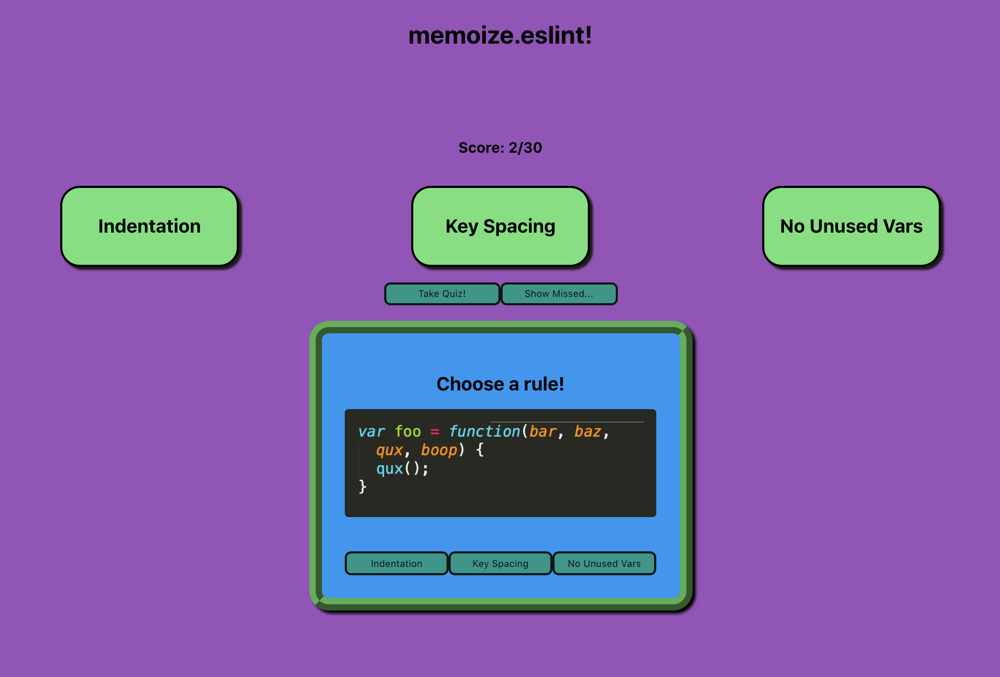
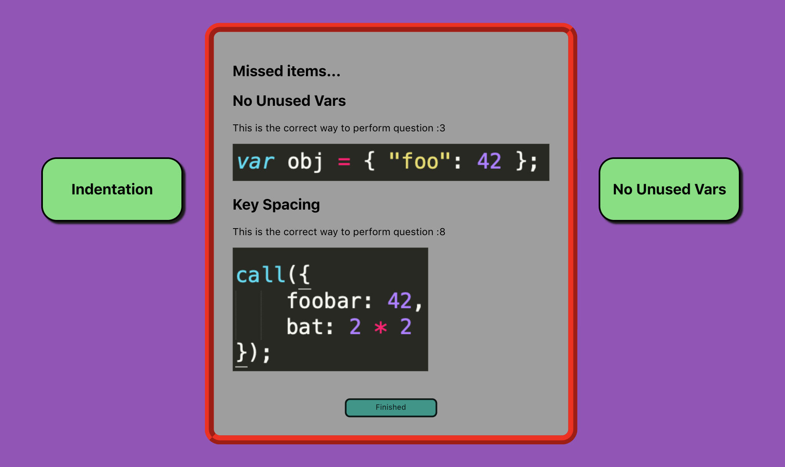

# ESLINT_QUIZER!

## Project By: Duy Vu

# Getting Started:
- Run npm install
- Run npm start

# For Testing: 
- Run npm test

# Languages:
- React
- Scss

## Goal:
This solo project was meant to show my current knowledge of React. With this project I used OOP rules to create my app. This helped me keep my class components and my functional components organized and meaningful. Conditional rendering was used to show and hide elements/componets. This app will allow the user to learn 3 eslinting rules according to Js Standards. The user will be able to read notes on each rules provided and given additional information from links. After the user is done studying they will have the chance to take a quiz. The quiz has instructions on how it starts and how it ends. using localStorage the user's results of the quiz will be saved for them so that they may see where they need to improve.

## My-Project

